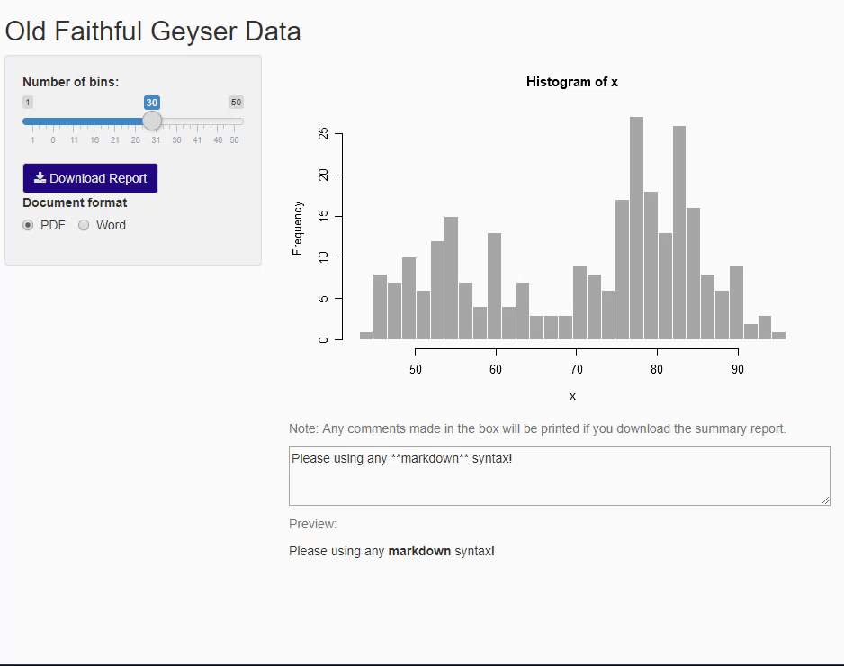

<!-- badges: start -->

<!-- badges: end -->

# noteMD
Print text from shiny ui (support markdown syntax) to pdf or word report!
This is a live demo shiny app using noteMD R package: https://appforiarteam.shinyapps.io/noteMD_shiny_demo/ 
Code of this live demo shiny app is here (welcome to download): https://github.com/jienagu/noteMD_shiny_app 

## Hexagon logo: 

## Acknowledgement
Beef Cattle Institute at Kansas State University: https://ksubci.org/ 

Special thanks to Yihui Xie (from RStudio.LLC), Dr. Brad White and Dr. David Amrine

## Install
`install.packages("noteMD")`

Install from GitHub :  
`devtools::install_github("jienagu/noteMD")`

Basically, this is how to use `noteMD` to insert a text box in your shiny ui (support markdown syntax) to pdf or word report!

* Step 1: create a textarea in shiny ui:
`                  tags$textarea(
                    "Please using any **markdown** syntax!",
                    id    = 'markdowninput',
                    rows  = 3,
                    style = 'width:100%;')`, here we know the id of this tag is `markdowninput` (you can name whatever you want)

* Step 2: if you want to have a preview in shiny app like the demo, use    `output$htmlmarkdown = reactive({note_in_html(input$markdowninput) }) ` , then `htmlOutput('htmlmarkdown')` in shiny ui

* Step 3: if your report is in pdf, put `note_in_md_pdf(input$markdowninput)` in an R chunk (whereever you want to insert the text); if your report is in word, put `note_in_md_word(input$markdowninput)` in an R chunk! 

Enjoy! 
        
